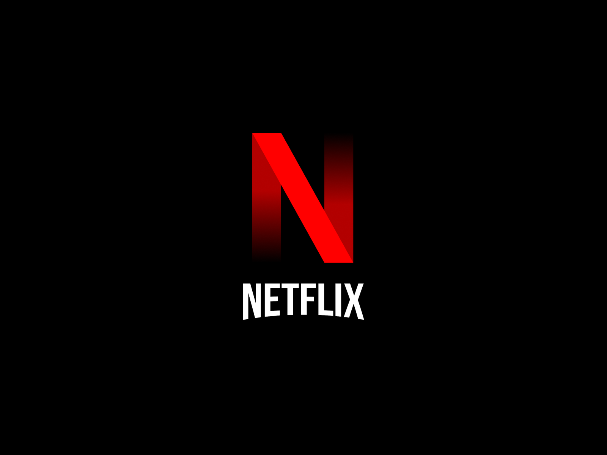

#  **Netflix clone website**

In this project I build a front-end Netflix clone with a Firebase back-end! I
use the TMDB API for all of the data and Firebase Authentication to give login
functionality. The website is able to store user specific data with a React
front-end and a Firebase back-end. I use Firestore which is cloud storage to
save data. The front-end is styled with Tailwind CSS. Also it was deployed with
Firebase Hosting. The website is designed to be fully responsive, adapting to
different screen sizes starting from a minimum width of 375px.

## Home Page

There is a random movie-image of one of the top movie of the day on the top of
the page. Also can find two buttons that allow you to SignIn or SignUp to our
Netflix clone website. Under the movie-image you’ll find gallery slidshows of 5
movies categories with the top movies. Each gallery slidshow has two buttons
that allow you to see top 20 of the catogory. On hover on a movie card you can
find the name of the movie and a little heart on the top left side. If you press
the heart it’ll be add the movie to your account. To enter on your account you
should Sign In or Sign Up.

## Sign In / Sign Up Page

Sign In and Sign Up: Users have the option to Sign In and Sign Up to their
accounts.

## Account Page

On Account Page you can find all movies that you have chosen on Home Page. Also
you can delete them from you list.

## Technologies Used

The Netflix clone website was built using the following technologies:

- React JS
- Tailwind CSS
- Firebase
- TMDB API
- React Router
- Axios

## Installation

1. To run this application locally on your computer, you need to have TypeScript
   installed globally.

2. Clone this repository: git clone
   https://github.com/Alekhandro24/netflix-website-reactjs-tailwindcss

3. Change into the project directory: cd netflix-website-reactjs-tailwindcss

4. Install the dependencies: npm install

5. Start the development server: npm start

6. Open your browser and visit http://localhost:3000 to view the application.

## Contact Information

- **Linkedin:**
  [alekhandro-lagonavarro](https://www.linkedin.com/in/alekhandro-lagonavarro/)
- **GitHub:** [Alekhandro24](https://github.com/Alekhandro24)
- **Tel:** [+380507695110](+380507695110)
- **Email:** [lagoalekhandro@gmail.com](https://www.gmail.com)
